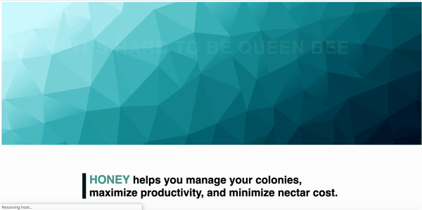
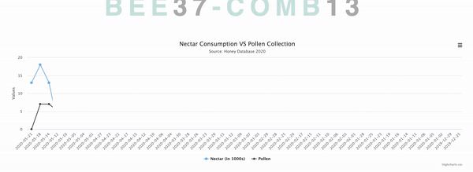
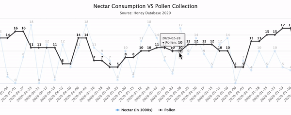
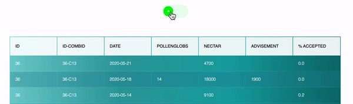
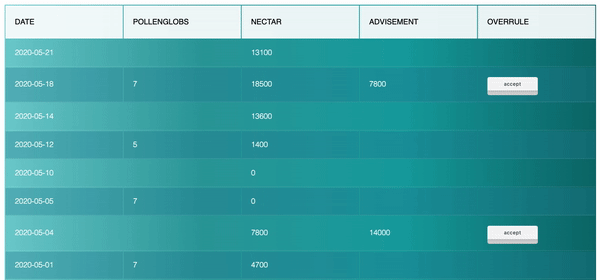
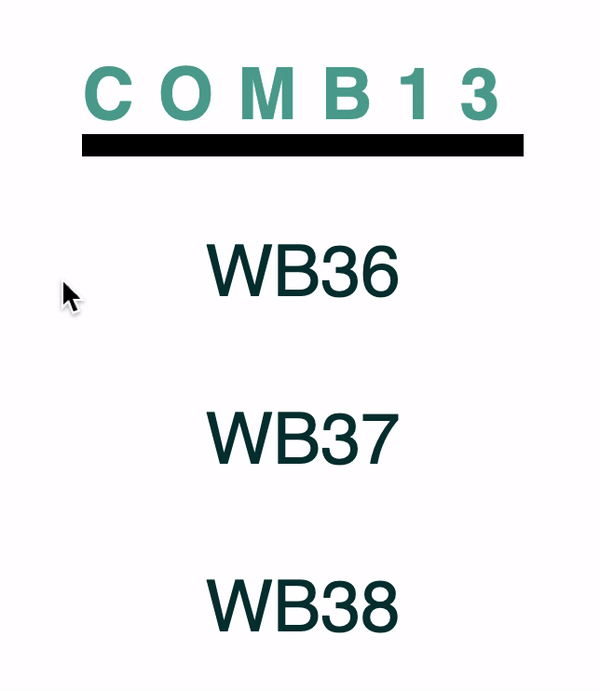
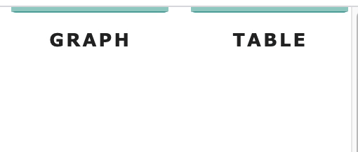

# Honey, a quick MVC rails app w/ graph
## Manage your colony with confidence

### Technologies Used
* **Ruby** ('2.5.1')
* **Ruby on Rails** ('~> 5.1.6.2') — with Turbolinks
* **Postgres** ('~> 11.2')
* **HighCharts JS**
* **SQL**
* **Faker**

---

### The Product 🐝
- Managing your worker bees has never been easier. Track nectar doses and pollen collected with a simple, easy-to-read graph and toggle between a regular and enhanced table to view bee data.
    <p align="center">
        
    </p>
### The Data 🐝
- Normalized the database in 3NF with no transitive functional dependencies
- Used an ActiveSupport concern to calculate Advisement Percentage
    ```
    require 'active_support/concern'
    module GETADV
    extend ActiveSupport::Concern
        def getAdvisementPercent()
            if @adv_perc
                return @adv_perc
            end
            active_adv = Advisement.current_adv(self.date_given, self.bee_id)
            unless active_adv 
                return [0]
            end
            nec_acc = active_adv.value == self.nectar_dosage ? [1] : [0]
            if active_adv.date_given == self.date_given
                @adv_perc = nec_acc
            else
                @adv_perc = NectarDosage.select("*").where("date_given < ?", self.date_given)
                .order("date_given").last.getAdvisementPercent().concat(nec_acc)
            end
            return @adv_perc
        end
    end
    ```
### The Graph 🐝
- Implemented HighCharts to visualize nectar dosage and pollen collected data
  <p align="center">
      
  </p> 
  <p align="center">
      
  </p>
- Added dataLabels and mouseTracking, and represented Nectar Dosages in 1000s for increased readability and easier visualization of the correlation between nectar and pollen
    ```
    plotOptions: {
        line: {
            dataLabels: {
                enabled: true
            },
            enableMouseTracking: true
        }
    },
    series: [{
        name: 'Nectar (in 1000s)',
        data: gon.nectar_dosage
    }, {
        name: 'Pollen',
        data: gon.pollen_globs_collected
    }]
    ```

### The Table 🐝
- Displayed a 'toggle-able' table to allow users to switch between Enhanced and Regular modes
  <p align="center">
      
  </p>
- Allow for Advisements to be Overruled (and Reaccepted) by a Cabeenet member via a custom button
    <p align="center">
        
    </p>
- Created a custom SQL query to present relevant information
    ```
    @bee_table = ActiveRecord::Base.connection.execute(
            "SELECT nec.bee_id, nec.date_given, nectar_dosage, pollen_globs_collected,
            value, adv.id AS adv_id, nec.id AS nec_id, accepted
            FROM nectar_dosages AS nec
            LEFT OUTER JOIN pollen_collecteds AS pol
            ON nec.date_given = pol.date_collected
            LEFT OUTER JOIN advisements AS adv ON
            nec.date_given = adv.date_given
            WHERE nec.bee_id = #{@worker_bee.id} AND (pol.bee_id = #{@worker_bee.id} OR pol.bee_id is NULL) AND
            (adv.bee_id = #{@worker_bee.id} OR adv.bee_id is NULL) ORDER BY nec.date_given DESC")
    ```
- Used JavaScript in the table's Slim file to implement the overrule button
    ```
    function editAdvisment(e) {
        let xhttp = new XMLHttpRequest();
        xhttp.open("PATCH", `/advisements/overrule/${e.name}`, true);
        xhttp.send();
        if (e.innerHTML === 'accept'){
            e.innerHTML = 'overrule';
        }else{
            e.innerHTML = 'accept';
        }
    }
    ```

### UI/UX Design 🐝
- Designed various interactive elements for a more intuitive user experience
    <p align="center" >
        
    </p> 
    <p align="center">
        
    </p>  
    <p align="center">
        
    </p>

### Thank you for reading. Happy collecting! 🐝
- Created by Victoria Campbell for Dosis Inc.

