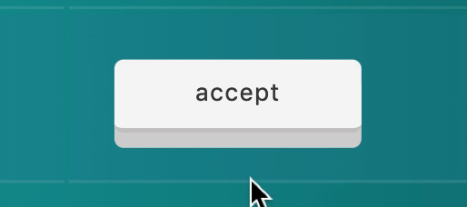

# Honey, a quick MVC rails app w/ graph
## Manage your colony with confidence

### Technologies Used
* **Ruby** ('2.5.1')
* **Ruby on Rails** ('~> 5.1.6.2') — with Turbolinks
* **Postgres** ('~> 11.2')
* **HighCharts JS**
* **Faker**

---

### The Product 🐝
- Managing your worker bees has never been easier. Track nectar doses and pollen collected with a simple, easy-to-read graph and toggle between a regular and enhanced table to view bee data.
    

        
    
 
### The Database 🐝
- Normalized the database in 3NF with no transitive functional dependencies

### The Graph 🐝
- Implemented HighCharts to visualize nectar dosage and pollen collected data
  

      
  
 
  

      
  
 

### The Table 🐝
- Created a 'toggle-able' table to allow users to switch between Enhanced and Regular modes
  

      
  

- Allow for Advisements to be Overruled (and Reaccepted) by a Cabeenet member via a custom button
    

        
    

### UI/UX Design 🐝
- Designed various interactive elements for a more intuitive user experience
    

        

            
        
 
        

            
        
  
        

            
        
 
    

